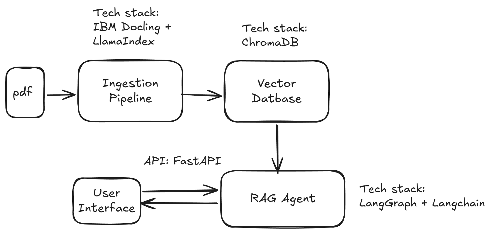

# fr_RAG

This project parses PDF financial statements to build a robust Retrieval-Augmented Generation (RAG) agent. By indexing financial data into a vector database, the agent provides grounded answers to user queries, effectively minimizing model hallucinations and ensuring data-driven accuracy.

## 🏗️ System Architecture

